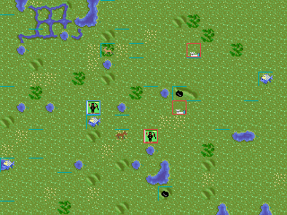
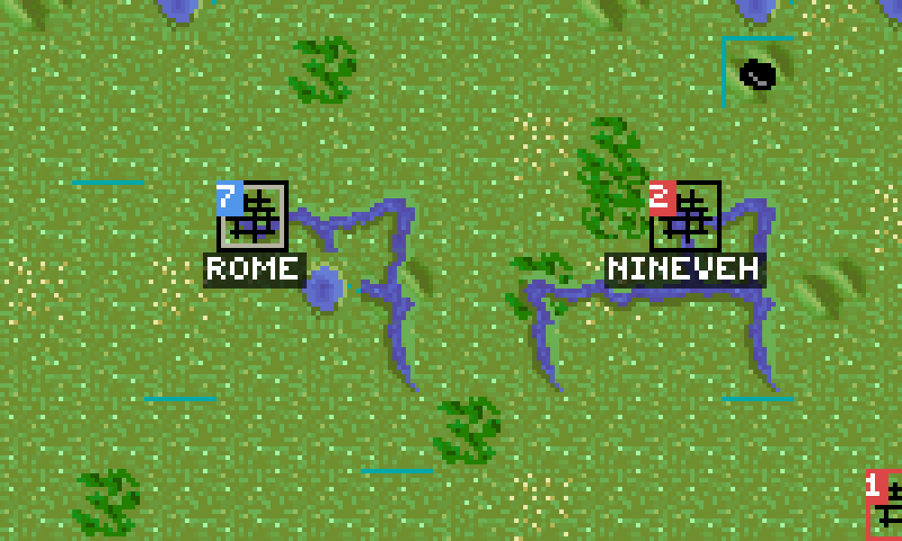
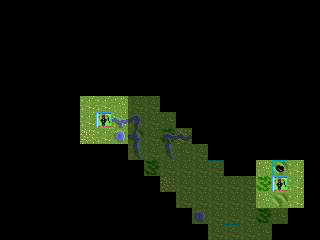

# civ-lisp

An **SDL2** front-end in Common Lisp (SBCL, [ocicl](https://github.com/ocicl/ocicl)
for dependencies) for a Civilization-like 4X game. It renders a live
[`civ-model`](docs/MODEL.md) game — map, units and cities — using sprites
extracted from the DOS game *Sid Meier's Civilization* (the sibling
[civ-extract](https://github.com/lispnik/civ-extract) project), with the
**torch** graphic as the mouse cursor.




*A game after 40 turns: edge-blended terrain (TER257), rivers and resource
specials (SP257), the human city/units (blue borders) and an AI opponent that
has expanded into several cities and units (red borders).*



*Cities rendered Civ1-style: a size box (population, in the owner's colour), the
city graphic, optional walls, a name label, and a **black border** when a
military unit garrisons it. Rome (size 7) and Nineveh (size 2) are both
defended; text uses a font extracted from the game's `FONTS.CV`.*



*Fog of war from the human's view: black = unexplored, dim = explored but out of
sight, bright = currently visible. A scout's trail is dimmed behind it.*

## Controls

| key | action |
|-----|--------|
| left-click | select a unit (wakes a fortified one), or open a friendly city's **build menu** |
| 1–9 / click | in the build menu, choose a unit, improvement, or wonder (`*`) to build; Esc closes |
| arrow keys | move the selected unit |
| Tab | cycle to the next active unit (skips fortified / out-of-moves) |
| W | wait — send the unit to the end of this turn's cycle |
| B | found a city (with a settlers unit) |
| F | fortify the selected unit (defense + faster healing) |
| G, then left-click | send the selected unit to a tile (auto-paths each turn); the cursor becomes the **Go** arrow |
| Enter | end turn |
| Esc | cancel a pending Go (restores the torch cursor); otherwise quit |

The map is covered by **fog of war**: unexplored tiles are black, tiles you've
seen but can't currently see are dimmed, and enemy units/cities show only while
in sight of one of your units or cities. The selected unit shows a small stats
panel (type, attack/defense, moves left, HP, terrain) in the bottom-left.

Terrain uses the original **edge-blending** scheme (CivOne's algorithm): a land
tile is a generic base plus a TER257 overlay chosen by a bitmask of which
cardinal neighbours share its terrain (N=1 E=2 S=4 W=8), so mismatched edges
feather into their neighbours; ocean tiles add coastline sub-tiles from the
eight surrounding land directions. Rivers (SP257 connection variants, +1 trade)
and per-terrain resource **specials** (SP257; e.g. grassland shields, ocean
fish, mountain gold) are drawn as overlays and feed into tile yields. Units and
cities use SP257 sprites. The map
fills the window exactly (20×15 tiles of 16 px, scaled 2× → 640×480). Keyboard
input is turned into `civ-model` commands — the view never mutates the model
directly. The rival civilization is run by a simple **AI** that issues the same
commands (it founds and spaces out cities, sets production, explores, and
researches); it takes its turn automatically whenever you end yours. Moving a
unit into an enemy-occupied tile triggers **combat** — a Civ1-style fight to the
death with terrain, fortification and city defense bonuses; win and your unit
advances onto the cleared tile. Damage carries between fights, so units **heal**
between turns when they stay put — fully in a city, faster when **fortified**
(`F`), slowly otherwise; fortifying also adds +50% defense (the AI fortifies its
city garrisons).

> **macOS / arm64 note:** cl-sdl2's high-level event accessors (`scancode-value`,
> the `:x`/`:y` destructuring) read the wrong `SDL_Event` struct offsets against
> SDL2 2.x on Apple Silicon, so keyboard/mouse came through as garbage. The front
> end instead runs its own `SDL_PollEvent` loop and reads fields at the documented
> byte offsets (scancode @16, mouse x/y @20/24). See `src/main.lisp`.

## Two systems

| system | what it is | depends on |
|--------|-----------|------------|
| **`civ-model`** | the pure game model — state + rules, **no SDL, no I/O** | (nothing) |
| **`civ-lisp`** | the SDL2 front-end (window, cursor, scaling) | `civ-model`, `sdl2`, `sdl2-image` |

The model is deliberately independent of rendering so it can be tested headless
and reused by tools / AI / a future networked client. See
[`docs/MODEL.md`](docs/MODEL.md) for the design and
[`examples/model-demo.lisp`](examples/model-demo.lisp) for a runnable tour:

```sh
sbcl --non-interactive --load examples/model-demo.lisp
```

## Requirements

* SBCL
* ocicl
* Native SDL2 + SDL2_image libraries (macOS: `brew install sdl2 sdl2_image`)

## Running

cl-sdl2's FFI bindings need a larger heap to compile, so pass
`--dynamic-space-size`:

```sh
ocicl install            # fetch sdl2 / sdl2-image (first time)
sbcl --dynamic-space-size 4096 --non-interactive --load run.lisp
```

A 640×480 window opens with the torch image as the cursor (drawn centred so you
can see it). Close the window or press **Escape** to quit.

## Global 2× scaling

The original Civilization assets are tiny on a modern display, so the whole app
is scaled by `*scale*` (default `2`). Two separate things are scaled:

* **Renderer drawing** — `SDL_RenderSetScale` multiplies every render coordinate,
  so the app draws in logical (320×240) space and SDL doubles it.
* **The mouse cursor** — OS cursors are *not* touched by the renderer, so the
  cursor surface is upscaled (nearest-neighbour via `SDL_UpperBlitScaled`)
  before the colour cursor is created. The 13×14 torch becomes a 26×28 cursor.

Change the factor at runtime:

```lisp
(setf civ-lisp:*scale* 3)
(civ-lisp:run)              ; or (civ-lisp:run :scale 3)
```

## Standalone executable

Dump a self-contained binary with `save-lisp-and-die`:

```sh
make                 # or: sbcl --dynamic-space-size 4096 --non-interactive --load build.lisp
./civ-lisp
```

This produces a ~15 MB `./civ-lisp` (a compressed SBCL core with the app and
all Lisp dependencies baked in). The native SDL2 / SDL2_image **shared
libraries are not embedded** — CFFI reloads them at startup, so they must be
installed on whatever machine runs the binary.

`make` targets: `make` (build), `make run` (run from source), `make deps`
(ocicl install), `make clean`.

## How it works

`sdl2-image:load-image` reads `assets/torch.png` into an SDL surface; that
surface becomes a colour cursor via the raw FFI call
`SDL_CreateColorCursor`, which is then made active with `SDL_SetCursor`
(cl-sdl2 doesn't wrap these high-level cursor calls, so we use the autowrap
`sdl2-ffi.functions` layer directly). See `src/main.lisp`.

```lisp
(asdf:load-system :civ-lisp)
(civ-lisp:main)                       ; runs on the macOS main thread
;; or, with options:
(civ-lisp:run :width 800 :height 600)
```

The cursor hotspot defaults to the top-left `(0,0)`; the torch image is 13×14.